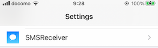
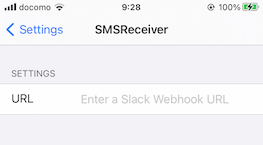

# SMSReceiver

This is a tweak to forward Apple's 2FA SMS to Slack channel.

### Requirements

* Jailbroken Device (iOS 14.0+)
* Xcode 13
* [theos](https://github.com/theos/theos)

### Setup

1. Install the tweak on your device with the `make package install` command.
2. Select SMSReceiver from the iPhone settings. 
3. Set Slack's WebHook URL. 
4. When the device receives an Apple 2FA SMS, it will be forwarded to Slack.

### FAQ

#### Q. Is it possible to forward non-Apple 2FA SMS?

A. The current source code only supports Apple's 2FA. If you want to forward other types of SMS, please modify the `- (BOOL)isAppleCodeSMS` function in Tweak.x.

## Author

Watanabe Toshinori – toshinori_watanabe@tiny.blue

## Acknowledgments

I used the following tweak code created by Aziz H as a reference to create this tweak. Many thanks for the great OSS:

*  [WebMessage-Tweak](https://github.com/sgtaziz/WebMessage-Tweak)
